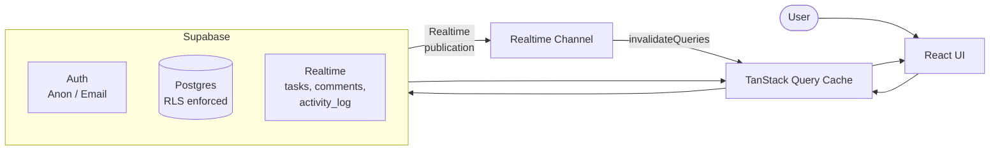
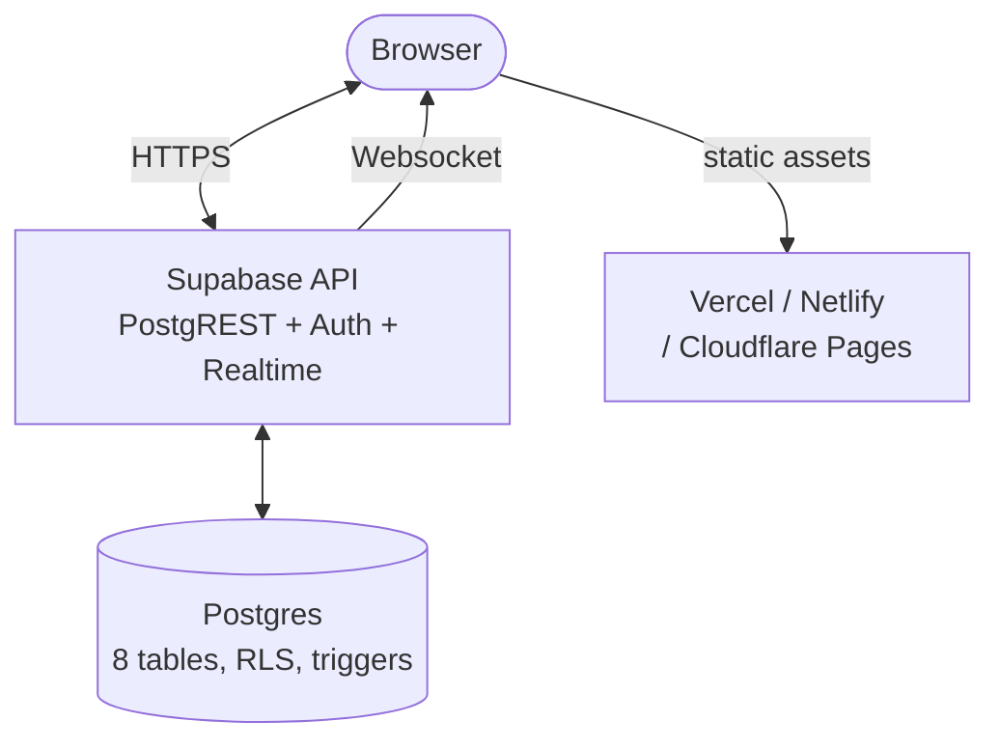

# Next Play — Kanban Task Board

A polished, full-stack Kanban board built for the Next Play internship assessment. Inspired by Linear, Asana, and Notion, with a neumorphic design language, real-time collaboration, and a complete feature set including spaces, comments, activity logs, labels, and board statistics.

---

## Live Demo

> Placeholder — add your Vercel / Netlify / Cloudflare Pages URL here after deployment.

---

## Screenshots

See the `screenshots/` folder. Add screenshots after first deployment.

---

## How to Run Locally

### Prerequisites

- Node.js 18 or later
- A Supabase project (free tier). See the Supabase Setup section below.
- Git

### Steps

```bash
# 1. Clone the repo
git clone <your-github-url>
cd next-play-app

# 2. Install dependencies
npm install

# 3. Create your environment file
cp .env.example .env.local
# Then edit .env.local and fill in the two variables (see .env.example for the keys):
#   VITE_SUPABASE_URL=https://<your-project-ref>.supabase.co
#   VITE_SUPABASE_ANON_KEY=<your-anon-key>

# 4. Start the dev server
npm run dev

# 5. Build for production
npm run build
```

---

## Supabase Setup

1. Create a free project at [supabase.com](https://supabase.com).
2. Run the SQL migrations located in `supabase/migrations/` in order (or paste the full schema from `docs/schema.md`) into the Supabase SQL editor.
3. Enable **Anonymous sign-in** in your Supabase dashboard: Authentication > Providers > Anonymous.
4. RLS is on for all tables. All policies are described in `docs/schema.md`. No additional configuration is needed.
5. Copy your project URL and anon key from Project Settings > API into `.env.local`.

The schema creates eight tables (`profiles`, `spaces`, `space_members`, `tasks`, `labels`, `task_labels`, `comments`, `activity_log`), several security-definer triggers, and a `reorder_task` RPC function. See `docs/schema.md` for the full reference including every RLS policy and Postgres function.

---

## Design Decisions

### Neumorphism

The UI uses soft dual-shadow neumorphism throughout: a lighter shadow on the top-left and a darker shadow on the bottom-right simulate a light source from the top-left. The base surface color is `#eef1f6` (near-white with a slight blue-grey tint). Pressed/inset states invert the shadows to create a "pushed in" affordance. This gives the board a tactile, physical feel without the flatness of pure minimalism.

### Color Palette

- **Surface base:** `#eef1f6` — all cards, columns, sidebar, modals
- **Surface sunken:** `#e8ecf2` — input fields (inset shadow)
- **Accent:** `#3b82f6` (blue-500) — primary buttons, active states, focus rings
- **Accent light:** `#60a5fa` (blue-400) — labels, hover highlights
- **Text:** `#1a2035` (headings), `#374156` (body), `#94a3b8` (muted)
- **Status colors:** slate (To Do), blue (In Progress), amber (In Review), emerald (Done)
- **Priority colors:** emerald (low), blue (normal), red (high)

The accent is used with restraint — primary action buttons, focus rings, active sidebar links, and label chips. Every other surface stays in the grey-white family.

### Typography

Single family: **Plus Jakarta Sans** (400, 500, 600, 700). Clear scale with generous line-height. Maximum two weights visible in any single view. All caps + wide tracking used sparingly for section labels.

### Drag-and-Drop Library

The brief specifies `react-beautiful-dnd`. That package is archived and incompatible with React 19's StrictMode, so we use [`@hello-pangea/dnd`](https://github.com/hello-pangea/dnd) — the actively maintained fork with an identical API. It provides accessible keyboard DnD out of the box (Tab to focus, Space to lift, arrow keys to move, Space to drop, Escape to cancel). Cards are memoized with `React.memo` so only the dragged card re-renders during a drag.

### Optimistic Updates

All mutations (create, update, delete, reorder) write to the TanStack Query cache before the Supabase call. On failure, the previous cache snapshot is restored and a toast is shown. Drag-and-drop reorders use the `reorder_task` Postgres RPC which atomically updates a single row; the frontend computes fractional floating-point positions (midpoint between neighbors) so no full-column rewrite is ever needed.

### Fractional Positioning

Tasks within a column are ordered by a `float8` position column. When a task is dropped at index `i`, the new position is `(prev + next) / 2` where `prev` and `next` are the positions of the tasks immediately before and after the insertion point. Edge cases (prepend, append, empty column) are handled explicitly. This is the same strategy used by Figma and Linear.

### Anonymous User Upgrade

On first launch, `supabase.auth.signInAnonymously()` creates a real auth row with `is_anonymous = true`. A corresponding `profiles` row is auto-inserted by trigger. All data (spaces, tasks, comments) is tied to this user's UUID. When the guest later provides email/password credentials, `supabase.auth.updateUser()` links the credential to the **existing** auth row — the UUID never changes. The `handle_user_updated` trigger then flips `profiles.anonymous` to `false`. No data migration is required.

### Session Isolation

The TanStack Query cache is a process-wide singleton, so on an account switch it will happily serve the previous user's spaces and tasks to the new session — a data-leak bug that also manifests as spurious RLS errors (inserting into a space the new user isn't a member of). `AuthProvider` guards against this by tracking the last-seen auth user id and calling `queryClient.cancelQueries()` + `removeQueries()` on every identity change: sign-out, sign-in as a different user, or account switch. `signInWithPassword` additionally signs out first and clears the cache before authenticating to eliminate races with in-flight queries. The guest-to-permanent upgrade path (`USER_UPDATED` event, same uuid) deliberately skips the clear so the user's work is preserved across the upgrade.

---

## Engineering Decisions

### Vite

Fast HMR, native ESM, tree-shaking, and lazy chunk splitting per route. Each page (`BoardPage`, `StatsPage`, `AuthPage`) is a separate lazy chunk loaded on demand.

### TanStack Query

All server state lives in TanStack Query. Cache keys are structured as `['tasks', spaceId]`, `['comments', taskId]`, `['labels', spaceId]`, etc. Realtime Supabase subscriptions call `queryClient.invalidateQueries()` on INSERT/UPDATE/DELETE events, so the cache stays fresh without polling. Local UI state (selected task, modal open/closed, filter inputs) is component-local and never lifted unnecessarily.

### State Management

TanStack Query owns all server state. Auth state lives in `AuthContext` (a single global store provided by `AuthProvider`). Everything else — modal state, panel open/close, filter values, local form inputs — is component-local `useState`. Zustand is available as a dependency but not used; TanStack Query made a separate global store unnecessary.

### Realtime Subscriptions

Three tables (`tasks`, `comments`, `activity_log`) are in the Supabase Realtime publication. Each relevant hook (`useRealtimeTasks`, `useRealtimeComments`, `useRealtimeActivity`) creates a single channel, filters by `space_id` or `task_id`, and cleans up the channel on unmount.

### @hello-pangea/dnd

Drop-in replacement for the archived `react-beautiful-dnd` required by the brief — same API, React 19 compatible. Cards are wrapped in `Draggable` and columns in `Droppable`. `BoardColumn` is memoized with `React.memo` and wrapped in `DragDropContext` at the board level. The drag handler is `useCallback`-memoized to avoid re-subscribing the DnD context on every render.

---

## Component Overview

| Component | Location | Purpose |
|---|---|---|
| `AppShell` | `components/layout/AppShell.tsx` | Full-page layout: sidebar + top bar + main content area |
| `Sidebar` | inside `AppShell.tsx` | Space list, nav links, guest upgrade nudge, user footer |
| `BoardPage` | `pages/BoardPage.tsx` | Kanban board — filter bar, DnD context, columns |
| `BoardColumn` | `components/board/BoardColumn.tsx` | Single status column with Droppable area and skeleton loading |
| `TaskCard` | `components/board/TaskCard.tsx` | Draggable card with priority dot, due-date badge, assignee avatar |
| `TaskDetailPanel` | `components/board/TaskDetailPanel.tsx` | Right slide-over panel with full task editing, labels, comments, activity |
| `FilterBar` | `components/board/FilterBar.tsx` | Search + filter toolbar persisted in URL search params |
| `CommentThread` | `components/tasks/CommentThread.tsx` | Real-time comment thread with edit/delete for own comments |
| `ActivityFeed` | `components/tasks/ActivityFeed.tsx` | Timeline of task events (created, moved, assigned, edited) |
| `LabelPicker` | `components/tasks/LabelPicker.tsx` | Multi-select label combobox with inline label creation |
| `ManageLabelsModal` | `components/tasks/ManageLabelsModal.tsx` | Space-level label CRUD with color picker |
| `NewTaskModal` | `components/board/NewTaskModal.tsx` | Create task modal |
| `NewSpaceModal` | `components/board/NewSpaceModal.tsx` | Create space modal |
| `StatsPage` | `pages/StatsPage.tsx` | Headline stats, status/priority charts, recent activity feed |
| `AuthPage` | `pages/AuthPage.tsx` | Guest sign-in, email/password sign-in, guest-to-member upgrade |
| `AuthProvider` | `providers/AuthProvider.tsx` | Auth context: user, anonymous flag, sign-in/up/out |
| `ToastProvider` | `providers/ToastProvider.tsx` | Global toast notification stack |
| `NeuButton` | `components/ui/NeuButton.tsx` | Neumorphic button (primary, secondary, ghost, danger variants) |
| `NeuAvatar` | `components/ui/NeuAvatar.tsx` | Avatar with deterministic hue from name string |
| `NeuBadge` | `components/ui/NeuBadge.tsx` | Small pill badge for labels, status indicators |
| `NeuModal` | `components/ui/NeuModal.tsx` | Accessible modal with focus trap and Escape-to-close |
| `NeuSkeleton` | `components/ui/NeuSkeleton.tsx` | Shimmer skeleton for loading states |
| `EmptyState` | `components/ui/EmptyState.tsx` | Thoughtful empty state with icon, message, and CTA |

---

## Data Flow Diagram



---

## System Diagram



---

## RLS Policies and Postgres Functions

All RLS policies and Postgres functions are documented in `docs/schema.md`. Key points:

- Default-deny on all eight tables; every row needs an explicit ALLOW policy.
- `is_space_member(p_space_id uuid)` is a `SECURITY DEFINER STABLE` helper that breaks the RLS recursion trap on `space_members`.
- `log_task_activity()` is a `SECURITY DEFINER` trigger on `tasks` that writes tamper-proof audit rows to `activity_log`. No client INSERT policy exists on `activity_log`.
- `reorder_task(p_task_id, p_status, p_position)` is the sole write path for drag-and-drop. It is `SECURITY INVOKER` so the caller's RLS context is respected.
- `handle_new_user`, `handle_user_updated`, `handle_new_space`, `handle_new_user_space` are auth-lifecycle triggers that auto-create `profiles`, `spaces`, and `space_members` rows on user and space creation.

---

## Folder Structure

```
src/
  App.tsx                       # Root with lazy-loaded routes and AnimatePresence transitions
  main.tsx
  index.css                     # Tailwind v4 @theme tokens + neumorphic utilities

  components/
    board/
      BoardColumn.tsx            # Droppable column with skeleton loading
      columnConfig.ts            # COLUMN_CONFIG constant (extracted for fast-refresh)
      FilterBar.tsx              # Search + filter toolbar
      filterTypes.ts             # BoardFilters type + DEFAULT_FILTERS constant
      NewSpaceModal.tsx
      NewTaskModal.tsx
      TaskCard.tsx               # Draggable card
      TaskDetailPanel.tsx        # Right slide-over panel
    layout/
      AppShell.tsx               # Sidebar + TopBar layout
      SpaceRedirect.tsx          # Redirects / to first available space
    tasks/
      ActivityFeed.tsx           # Task activity timeline
      CommentThread.tsx          # Real-time comment thread
      LabelPicker.tsx            # Multi-select label combobox
      ManageLabelsModal.tsx      # Label CRUD
    ui/
      EmptyState.tsx
      ErrorBoundary.tsx
      NeuAvatar.tsx
      NeuBadge.tsx
      NeuButton.tsx
      NeuCard.tsx
      NeuIconButton.tsx
      NeuInput.tsx
      NeuModal.tsx
      NeuSkeleton.tsx
      index.ts

  hooks/
    useActivity.ts               # useTaskActivity, useSpaceActivity, useRealtimeActivity
    useBoardFilters.ts           # URL-persisted filter state + applyFilters()
    useComments.ts               # CRUD + realtime for comments
    useLabels.ts                 # Labels CRUD + addLabelToTask, removeTaskLabel
    useMembers.ts
    useSpaces.ts
    useTasks.ts                  # Tasks CRUD + realtime + computePosition

  lib/
    auth.ts
    cn.ts
    database.types.ts            # Generated Supabase types
    supabase.ts
    db/
      activity.ts                # listTaskActivity, listSpaceActivity
      comments.ts                # CRUD functions
      labels.ts                  # CRUD + junction functions
      members.ts
      spaces.ts
      tasks.ts

  pages/
    AuthPage.tsx
    BoardPage.tsx
    StatsPage.tsx

  providers/
    AuthContext.ts               # AuthContext + AuthContextValue type
    AuthProvider.tsx             # AuthProvider component only
    useAuth.ts                   # useAuth hook (separate file for fast-refresh)
    QueryProvider.tsx
    ToastContext.ts              # ToastContext + types
    ToastProvider.tsx            # ToastProvider component only
    useToast.ts                  # useToast hook (separate file for fast-refresh)
```

---

## Features Checklist

### Core (Required)

- [x] Kanban board with To Do, In Progress, In Review, Done columns
- [x] Drag tasks between columns — `@hello-pangea/dnd` (the maintained fork of `react-beautiful-dnd`)
- [x] Optimistic updates with rollback on error
- [x] Guest accounts via Supabase anonymous sign-in
- [x] Guest-to-email upgrade without creating a new user
- [x] RLS — users only see their own data
- [x] Tasks persist in Supabase
- [x] Loading, empty, and error states on all data-backed views
- [x] Responsive layout (horizontal scroll on mobile, sidebar drawer)

### Advanced

- [x] Spaces — create multiple spaces, each with its own board
- [x] Team members / assignees — display on cards, filter by assignee, assign in detail panel
- [x] Task comments — real-time thread with edit/delete for own comments
- [x] Activity log — timeline of status changes, assignments, edits per task
- [x] Labels / tags — per-space labels with color picker, multi-select picker on tasks, board filter by label, label management modal
- [x] Due-date indicators — overdue and due-soon badges on cards
- [x] Search and filters — fuzzy search on title/description, filter by priority/assignee/label/due-date, URL-persisted, composable, shows "X of Y tasks"
- [x] Board stats page — headline numbers, status bar chart, priority bar chart, recent activity feed
- [x] Page transitions — framer-motion fade+slide between routes
- [x] Keyboard accessibility — Escape closes panels/modals, `@hello-pangea/dnd` keyboard DnD

---

## Credits

Built with React 19, Vite, TypeScript, TailwindCSS v4, Supabase, `@hello-pangea/dnd`, TanStack Query, framer-motion, date-fns, and lucide-react.
