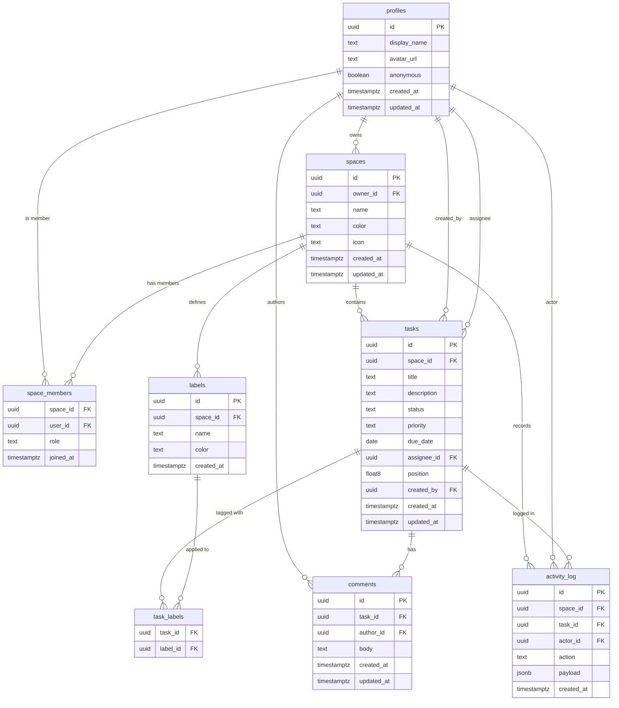

# Next Play — Database Schema Reference

## Overview

The Next Play data model is built on eight public Postgres tables managed entirely through Supabase (no custom backend). Key design choices:

- **Fractional positioning** (`float8`) on `tasks.position` follows the Figma/Linear pattern: drag-and-drop only writes the moved row by setting its position to the midpoint between its new neighbors. No full-column rewrite is ever needed, and realistic board sizes will never exhaust float64 precision.
- **`text + CHECK` over Postgres enums** for `status` and `priority` columns. Postgres `ALTER TYPE ... ADD VALUE` is non-transactional and awkward; CHECK constraints are easier to evolve while providing equal safety for small value sets.
- **Anonymous users as first-class citizens.** Supabase anonymous sign-in creates a real `auth.users` row with `is_anonymous = true`. A corresponding `profiles` row is inserted by trigger with `anonymous = true`. When the guest later links an email/password identity, `auth.uid()` never changes — the same `profiles.id` is retained and `anonymous` flips to `false`. No data migration, no orphaned rows.
- **`is_space_member(uuid)` security-definer helper** breaks the classic RLS infinite-recursion trap. A naive policy on `space_members` that does `EXISTS (SELECT 1 FROM space_members ...)` recurses forever. The helper is `security definer` so it bypasses RLS on `space_members` when called from within other policies. It is also marked `STABLE` so the planner caches its result once per statement rather than evaluating it per row.
- **Default-deny RLS everywhere.** RLS is enabled on all eight tables. No row is visible unless an explicit `ALLOW` policy matches. Policies consistently use `(SELECT auth.uid())` — wrapping in a subquery caches the call once per query.

---

## Mermaid ER Diagram



---

## Tables

### `profiles`

Mirrors `auth.users` with a stable `id` (same UUID as the auth row). Created automatically by the `handle_new_user` trigger on every new auth user; never inserted directly by the client.

| Column | Type | Constraints |
|---|---|---|
| `id` | `uuid` | PK, FK to `auth.users(id)` ON DELETE CASCADE |
| `display_name` | `text` | nullable |
| `avatar_url` | `text` | nullable |
| `anonymous` | `boolean` | NOT NULL, DEFAULT `false` |
| `created_at` | `timestamptz` | NOT NULL, DEFAULT `now()` |
| `updated_at` | `timestamptz` | NOT NULL, DEFAULT `now()`, managed by trigger |

**Indexes:** Primary key on `id` (implicit).

**RLS:**
- SELECT — owner only (`auth.uid() = id`)
- UPDATE — owner only (`auth.uid() = id`)
- INSERT — no client policy; handled exclusively by `handle_new_user` security-definer trigger

---

### `spaces`

A named workspace board owned by one user. A user can own many spaces (Work, Personal, etc.). `owner_id` is denormalized from `space_members` for fast ownership checks without a join.

| Column | Type | Constraints |
|---|---|---|
| `id` | `uuid` | PK, DEFAULT `gen_random_uuid()` |
| `owner_id` | `uuid` | NOT NULL, FK to `profiles(id)` ON DELETE CASCADE |
| `name` | `text` | NOT NULL |
| `color` | `text` | NOT NULL, DEFAULT `'#60a5fa'` |
| `icon` | `text` | nullable |
| `created_at` | `timestamptz` | NOT NULL, DEFAULT `now()` |
| `updated_at` | `timestamptz` | NOT NULL, managed by trigger |

**Indexes:**
- `spaces_owner_id_idx` on `(owner_id)`

**RLS:**
- SELECT — any space member (`is_space_member(id)`)
- INSERT — authenticated user who sets themselves as owner (`auth.uid() = owner_id`)
- UPDATE — owner only (`auth.uid() = owner_id`)
- DELETE — owner only (`auth.uid() = owner_id`)

---

### `space_members`

Explicit membership table. The space owner is always present with `role = 'owner'`, auto-inserted by the `handle_new_space` trigger. Additional members can be added for the team-members feature.

| Column | Type | Constraints |
|---|---|---|
| `space_id` | `uuid` | NOT NULL, FK to `spaces(id)` ON DELETE CASCADE |
| `user_id` | `uuid` | NOT NULL, FK to `profiles(id)` ON DELETE CASCADE |
| `role` | `text` | NOT NULL, DEFAULT `'member'`, CHECK IN (`'owner'`, `'member'`) |
| `joined_at` | `timestamptz` | NOT NULL, DEFAULT `now()` |

**Primary key:** `(space_id, user_id)`

**Indexes:**
- `space_members_user_id_idx` on `(user_id)`
- `space_members_space_id_idx` on `(space_id)`

**RLS:**
- SELECT — any member of the space (`is_space_member(space_id)`). Direct `EXISTS (SELECT 1 FROM space_members ...)` would recurse; the security-definer helper avoids this.
- INSERT — space owner only (verified via join to `spaces.owner_id`)
- DELETE — space owner only (verified via join to `spaces.owner_id`)
- No UPDATE policy — role changes are not currently supported from the client.

---

### `tasks`

The core Kanban card. Each task belongs to exactly one space and one status column. `position` is a fractional float8 index for ordering within `(space_id, status)`.

| Column | Type | Constraints |
|---|---|---|
| `id` | `uuid` | PK, DEFAULT `gen_random_uuid()` |
| `space_id` | `uuid` | NOT NULL, FK to `spaces(id)` ON DELETE CASCADE |
| `title` | `text` | NOT NULL |
| `description` | `text` | nullable |
| `status` | `text` | NOT NULL, DEFAULT `'todo'`, CHECK IN (`'todo'`, `'in_progress'`, `'in_review'`, `'done'`) |
| `priority` | `text` | NOT NULL, DEFAULT `'normal'`, CHECK IN (`'low'`, `'normal'`, `'high'`) |
| `due_date` | `date` | nullable |
| `assignee_id` | `uuid` | nullable, FK to `profiles(id)` ON DELETE SET NULL |
| `position` | `float8` | NOT NULL, DEFAULT `0` |
| `created_by` | `uuid` | NOT NULL, FK to `profiles(id)` ON DELETE CASCADE |
| `created_at` | `timestamptz` | NOT NULL, DEFAULT `now()` |
| `updated_at` | `timestamptz` | NOT NULL, managed by trigger |

**Indexes:**
- `tasks_space_status_position_idx` on `(space_id, status, position)` — board load hot path
- `tasks_created_by_idx` on `(created_by)`
- `tasks_assignee_id_idx` on `(assignee_id)`

**RLS:**
- SELECT — space members (`is_space_member(space_id)`)
- INSERT — space members, and caller must be `created_by` (`auth.uid() = created_by AND is_space_member(space_id)`)
- UPDATE — space members (`is_space_member(space_id)`), covering drag-and-drop status/position changes and edits
- DELETE — task creator OR space owner

---

### `labels`

Per-space named tags (Bug, Feature, Design, etc.). Scoped to a space so label names are reusable without collision across workspaces.

| Column | Type | Constraints |
|---|---|---|
| `id` | `uuid` | PK, DEFAULT `gen_random_uuid()` |
| `space_id` | `uuid` | NOT NULL, FK to `spaces(id)` ON DELETE CASCADE |
| `name` | `text` | NOT NULL |
| `color` | `text` | NOT NULL, DEFAULT `'#60a5fa'` |
| `created_at` | `timestamptz` | NOT NULL, DEFAULT `now()` |

**Unique constraint:** `(space_id, name)` — label names are unique within a space.

**Indexes:**
- `labels_space_id_idx` on `(space_id)`

**RLS:**
- SELECT — space members
- INSERT — space members
- UPDATE — space members
- DELETE — space owner only

---

### `task_labels`

Many-to-many junction between tasks and labels. Preferred over a Postgres array column for queryability and referential integrity.

| Column | Type | Constraints |
|---|---|---|
| `task_id` | `uuid` | NOT NULL, FK to `tasks(id)` ON DELETE CASCADE |
| `label_id` | `uuid` | NOT NULL, FK to `labels(id)` ON DELETE CASCADE |

**Primary key:** `(task_id, label_id)`

**Indexes:**
- `task_labels_label_id_idx` on `(label_id)` — find all tasks tagged with a label

**RLS:** All three operations (SELECT, INSERT, DELETE) require the caller to be a member of the space that owns the task. Implemented as `EXISTS (SELECT 1 FROM tasks t JOIN space_members sm ON sm.space_id = t.space_id WHERE t.id = task_labels.task_id AND sm.user_id = auth.uid())`. `is_space_member` is not used here because the lookup must first resolve the task's space — a direct join is cleaner.

---

### `comments`

Chronological comments on a task, shown in the task detail panel.

| Column | Type | Constraints |
|---|---|---|
| `id` | `uuid` | PK, DEFAULT `gen_random_uuid()` |
| `task_id` | `uuid` | NOT NULL, FK to `tasks(id)` ON DELETE CASCADE |
| `author_id` | `uuid` | NOT NULL, FK to `profiles(id)` ON DELETE CASCADE |
| `body` | `text` | NOT NULL |
| `created_at` | `timestamptz` | NOT NULL, DEFAULT `now()` |
| `updated_at` | `timestamptz` | NOT NULL, managed by trigger |

**Indexes:**
- `comments_task_id_created_at_idx` on `(task_id, created_at)` — load all comments for a task in order
- `comments_author_id_idx` on `(author_id)` — unindexed FK flagged by advisor (migration 007)

**RLS:**
- SELECT — space members (resolved via task to space join)
- INSERT — space members, and caller must be `author_id`
- UPDATE — comment author only
- DELETE — comment author OR space owner

---

### `activity_log`

Append-only audit trail for task events. `task_id` is nullable so history is retained after task deletion. No client INSERT, UPDATE, or DELETE policies — writes go exclusively through the `log_task_activity` security-definer trigger.

| Column | Type | Constraints |
|---|---|---|
| `id` | `uuid` | PK, DEFAULT `gen_random_uuid()` |
| `space_id` | `uuid` | NOT NULL, FK to `spaces(id)` ON DELETE CASCADE |
| `task_id` | `uuid` | nullable, FK to `tasks(id)` ON DELETE SET NULL |
| `actor_id` | `uuid` | nullable, FK to `profiles(id)` ON DELETE SET NULL |
| `action` | `text` | NOT NULL — values: `task.created`, `task.status_changed`, `task.assigned`, `task.edited`, `task.deleted` |
| `payload` | `jsonb` | NOT NULL, DEFAULT `'{}'` — before/after values keyed by action |
| `created_at` | `timestamptz` | NOT NULL, DEFAULT `now()` |

**Indexes:**
- `activity_log_space_id_created_at_idx` on `(space_id, created_at DESC)` — activity feed hot path
- `activity_log_task_id_idx` on `(task_id)` — task-specific history
- `activity_log_actor_id_idx` on `(actor_id)` — unindexed FK flagged by advisor (migration 007)

**RLS:**
- SELECT — space members (`is_space_member(space_id)`)
- INSERT/UPDATE/DELETE — no client policies; the table is write-protected from the client

---

## Functions and Triggers

### `handle_updated_at()`

```
returns trigger  |  language plpgsql  |  security invoker
```

Generic `BEFORE UPDATE` trigger function. Sets `NEW.updated_at = now()` before any update commits. Attached to `profiles`, `spaces`, `tasks`, and `comments` via individual `*_updated_at` triggers. Security invoker is safe because it only writes a column on the row being updated by the already-authorized caller.

---

### `handle_new_user()`

```
returns trigger  |  language plpgsql  |  security definer
```

Fires `AFTER INSERT ON auth.users`. Inserts a row into `public.profiles` using `is_anonymous`, `raw_user_meta_data->>'display_name'`, and `raw_user_meta_data->>'avatar_url'` from the new auth row. Uses `ON CONFLICT (id) DO NOTHING` to be idempotent. Security definer is required because `auth.users` is in the `auth` schema and the calling context has no direct permission there.

---

### `handle_user_updated()`

```
returns trigger  |  language plpgsql  |  security definer
```

Fires `AFTER UPDATE ON auth.users`. Syncs `profiles.anonymous`, `profiles.display_name`, and `profiles.avatar_url` from the updated auth row. This is the mechanism by which `anonymous` flips to `false` when a guest links an email/password identity — Supabase sets `auth.users.is_anonymous = false` on successful `linkIdentity`, and this trigger propagates the change. Security definer for the same reason as `handle_new_user`.

---

### `handle_new_space()`

```
returns trigger  |  language plpgsql  |  security definer
```

Fires `AFTER INSERT ON public.spaces`. Auto-inserts the space owner into `space_members` with `role = 'owner'`. Security definer is required because the trigger must write to `space_members` even during contexts where the calling user might not yet have an INSERT policy result (timing during profile creation cascade).

---

### `handle_new_user_space()`

```
returns trigger  |  language plpgsql  |  security definer
```

Fires `AFTER INSERT ON public.profiles`. Auto-creates a default "Personal" space for every new user (including anonymous guests). Security definer is required because inserting into `spaces` must bypass the RLS INSERT check — at trigger time the session context is the Postgres superuser role, not the user.

---

### `is_space_member(p_space_id uuid)`

```
returns boolean  |  language sql  |  security definer  |  stable
```

Returns `true` if `auth.uid()` has a row in `space_members` for the given `space_id`. This is the central RLS helper used by policies on `spaces`, `space_members`, `tasks`, `labels`, and `activity_log`.

**Why security definer:** A policy on `space_members` that used a plain `EXISTS (SELECT 1 FROM space_members ...)` would cause Postgres to re-evaluate the RLS policy on `space_members` recursively. By making the helper `security definer`, it executes with the function owner's privileges and bypasses RLS on `space_members` entirely, breaking the cycle.

**Why stable:** The `STABLE` volatility marker tells the Postgres planner the function returns the same result for the same inputs within a single statement. The planner can cache the result and avoid repeated executions per row in a large scan.

---

### `log_task_activity()`

```
returns trigger  |  language plpgsql  |  security definer
```

Fires `AFTER INSERT OR UPDATE OR DELETE ON public.tasks`. Appends rows to `activity_log` based on what changed:

- `INSERT` — `task.created` with `{title, status}`
- `UPDATE` — one row per changed field group:
  - `status` changed — `task.status_changed` with `{from, to}`
  - `assignee_id` changed — `task.assigned` with `{from, to}`
  - `title` or `description` changed — `task.edited` with `{fields: [...]}`
- `DELETE` — `task.deleted` with `{task_id, title}`. The inserted row sets `activity_log.task_id = null` because an `AFTER DELETE` trigger fires after the task row is already gone — referencing `old.id` via the FK would raise `activity_log_task_id_fkey` and surface as a 409 on the client. The deleted id is preserved in the payload instead.

Security definer is required because there is no client INSERT policy on `activity_log` — the table is intentionally write-protected from the client to keep the log tamper-proof.

---

### `reorder_task(p_task_id uuid, p_status text, p_position float8)`

```
returns void  |  language plpgsql  |  security invoker
```

RPC called by the drag-and-drop handler. Validates `p_status` against the allowed set, then issues a single `UPDATE` on `tasks`. Security invoker is correct here: the caller's identity is retained, so the UPDATE runs under the caller's RLS context — a non-member cannot reorder tasks in a space they do not belong to.

---

## RLS Policies

All tables have RLS enabled. Policies use `(SELECT auth.uid())` — the subquery form — to ensure the auth function is evaluated once per query rather than once per row.

### `profiles`

| Policy name | Operation | Rule |
|---|---|---|
| `profiles: owner can select` | SELECT | `(SELECT auth.uid()) = id` — you can only read your own profile |
| `profiles: owner can update` | UPDATE | `(SELECT auth.uid()) = id` — you can only edit your own profile |

No INSERT policy: the `handle_new_user` security-definer trigger is the only writer.

---

### `spaces`

| Policy name | Operation | Rule |
|---|---|---|
| `spaces: members can select` | SELECT | `is_space_member(id)` — any member (including owner) can read the space |
| `spaces: authenticated can insert` | INSERT | `(SELECT auth.uid()) = owner_id` — you can only create spaces where you are the owner |
| `spaces: owner can update` | UPDATE | `(SELECT auth.uid()) = owner_id` — only the owner can rename or recolor |
| `spaces: owner can delete` | DELETE | `(SELECT auth.uid()) = owner_id` — only the owner can delete |

---

### `space_members`

| Policy name | Operation | Rule |
|---|---|---|
| `space_members: members can select` | SELECT | `is_space_member(space_id)` — avoids self-referential recursion; see helper notes above |
| `space_members: owner can insert` | INSERT | `EXISTS (SELECT 1 FROM spaces s WHERE s.id = space_members.space_id AND s.owner_id = auth.uid())` |
| `space_members: owner can delete` | DELETE | Same owner check as INSERT |

No UPDATE policy: role changes are not supported from the client.

---

### `tasks`

| Policy name | Operation | Rule |
|---|---|---|
| `tasks: space members can select` | SELECT | `is_space_member(space_id)` |
| `tasks: space members can insert` | INSERT | `auth.uid() = created_by AND is_space_member(space_id)` — prevents creating tasks on behalf of another user |
| `tasks: space members can update` | UPDATE | `is_space_member(space_id)` — any member can move or edit tasks (covers DnD) |
| `tasks: creator or owner can delete` | DELETE | `auth.uid() = created_by OR EXISTS (SELECT 1 FROM spaces WHERE id = tasks.space_id AND owner_id = auth.uid())` |

---

### `labels`

| Policy name | Operation | Rule |
|---|---|---|
| `labels: space members can select` | SELECT | `is_space_member(space_id)` |
| `labels: space members can insert` | INSERT | `is_space_member(space_id)` |
| `labels: space members can update` | UPDATE | `is_space_member(space_id)` |
| `labels: space owner can delete` | DELETE | `EXISTS (SELECT 1 FROM spaces WHERE id = labels.space_id AND owner_id = auth.uid())` — only the owner can delete labels to prevent accidental removal by other members |

---

### `task_labels`

| Policy name | Operation | Rule |
|---|---|---|
| `task_labels: space members can select` | SELECT | `EXISTS (SELECT 1 FROM tasks t JOIN space_members sm ON sm.space_id = t.space_id WHERE t.id = task_labels.task_id AND sm.user_id = auth.uid())` |
| `task_labels: space members can insert` | INSERT | Same join as SELECT |
| `task_labels: space members can delete` | DELETE | Same join as SELECT |

`is_space_member` is not used here because `task_labels` has no direct `space_id` column — membership must be resolved through the `tasks` table first. A direct join is semantically clearer than nesting `is_space_member` inside a task lookup.

---

### `comments`

| Policy name | Operation | Rule |
|---|---|---|
| `comments: space members can select` | SELECT | Task to space join plus `sm.user_id = auth.uid()` |
| `comments: space members can insert` | INSERT | `auth.uid() = author_id` AND task to space join — prevents posting comments attributed to someone else |
| `comments: author can update` | UPDATE | `auth.uid() = author_id` — only you can edit your own comment |
| `comments: author or owner can delete` | DELETE | `auth.uid() = author_id OR EXISTS (SELECT 1 FROM tasks t JOIN spaces s ON s.id = t.space_id WHERE t.id = comments.task_id AND s.owner_id = auth.uid())` |

---

### `activity_log`

| Policy name | Operation | Rule |
|---|---|---|
| `activity_log: space members can select` | SELECT | `is_space_member(space_id)` — all members can see the audit trail |

No INSERT/UPDATE/DELETE client policies — the log is tamper-proof; all writes go through the `log_task_activity` security-definer trigger.

---

## Realtime

The following tables are added to the `supabase_realtime` publication:

| Table | Reason |
|---|---|
| `public.tasks` | Enables live board updates: when any space member moves or edits a task, all other connected members see the change without polling. |
| `public.comments` | Enables live comment threads in the task detail panel. |
| `public.activity_log` | Enables live activity feed updates in the space sidebar. |

`profiles`, `spaces`, `space_members`, `labels`, and `task_labels` are not in the publication — changes to these are infrequent and do not require live push semantics.

RLS is respected by Supabase Realtime: a subscriber only receives change events for rows they are authorized to SELECT under the existing RLS policies.

---

## Anonymous User Upgrade Flow

1. **First launch.** The frontend calls `supabase.auth.signInAnonymously()`. Supabase creates an `auth.users` row with `is_anonymous = true`.
2. **Profile row created.** The `handle_new_user` trigger fires, inserting a `profiles` row with `anonymous = true` and the same UUID.
3. **Default space created.** The `on_profile_created_space` trigger fires on `profiles`, inserting a "Personal" space and (via `on_space_created`) adding the user to `space_members` as owner.
4. **Guest uses the app.** All RLS policies treat anonymous users identically to permanent users — they have a valid `auth.uid()`.
5. **Guest decides to register.** The frontend calls `supabase.auth.linkIdentity({ provider: 'email' })` (or equivalent OTP / OAuth flow). Supabase links the credential to the existing `auth.users` row and sets `is_anonymous = false`. No new user is created.
6. **Profile updated.** The `on_auth_user_updated` trigger fires, setting `profiles.anonymous = false` and syncing `display_name` and `avatar_url` from metadata.
7. **Result.** `profiles.id` is unchanged. All tasks, spaces, comments, and activity created during the guest session remain linked to the same user. No data migration required.

This approach specifically avoids calling `supabase.auth.signUp()` after the guest session, which would create a second `auth.users` row and require merging data.

---

## Reorder RPC Usage

The `reorder_task` function is the only write path used during drag-and-drop. The frontend must compute the target `position` before calling it.

### Computing fractional position

```typescript
// tasks in the destination column, sorted by position ascending
const columnTasks = tasks
  .filter(t => t.space_id === activeSpaceId && t.status === destinationStatus)
  .sort((a, b) => a.position - b.position);

// Insert at index `destinationIndex` (0-based)
const prev = columnTasks[destinationIndex - 1]?.position ?? 0;
const next = columnTasks[destinationIndex]?.position ?? prev + 2000;
const newPosition = (prev + next) / 2;
```

Edge cases:
- Prepend (index 0): `prev = 0`, `next = columnTasks[0].position`, `newPosition = next / 2`
- Append (past end): `next = prev + 2000`, `newPosition = prev + 1000`
- Empty column: `prev = 0`, `next = 2000`, `newPosition = 1000`

### Calling the RPC

```typescript
const { error } = await supabase.rpc('reorder_task', {
  p_task_id:  draggedTask.id,
  p_status:   destinationStatus,   // 'todo' | 'in_progress' | 'in_review' | 'done'
  p_position: newPosition,
});

if (error) {
  // Roll back optimistic update in UI state
  console.error('reorder failed', error);
}
```

Apply the optimistic update to local state before the RPC call and roll it back on error.

---

## How to Regenerate TypeScript Types

### Using the Supabase CLI (recommended for CI)

```bash
npx supabase gen types typescript \
  --project-id zgrxevscvjyblzfddsbb \
  --schema public \
  > src/types/supabase.ts
```

Requires `SUPABASE_ACCESS_TOKEN` in the environment (not committed — set in your shell or CI secrets).

### Using the MCP server (development)

The project's MCP server (`supabase-nextplay`) exposes a `generate_typescript_types` tool. In Claude Code:

```
Use the supabase MCP tool to generate TypeScript types for project zgrxevscvjyblzfddsbb
```

This does not require a separate token — it uses the OAuth session already authenticated in the Claude Code credential store.

### After regenerating

Import the generated types into the Supabase client:

```typescript
import { createClient } from '@supabase/supabase-js';
import type { Database } from './types/supabase';

export const supabase = createClient<Database>(
  import.meta.env.VITE_SUPABASE_URL,
  import.meta.env.VITE_SUPABASE_ANON_KEY,
);
```

This provides full type inference for all table operations, RPC calls, and realtime payloads.
